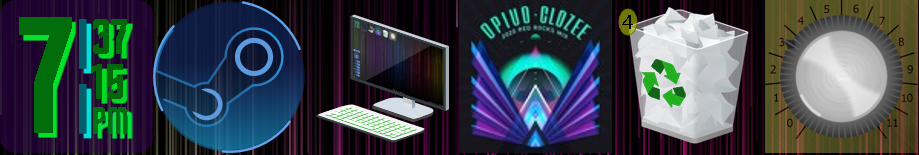

.. image:: https://github.com/2bndy5/Goo-e-Rainmeter-Skin/workflows/Anti-virus%20Check/badge.svg
    :target: https://github.com/2bndy5/Goo-e-Rainmeter-Skin/actions?query=workflow%3A%22Anti-virus+Check%22

.. image:: https://github.com/2bndy5/Goo-e-Rainmeter-Skin/workflows/RMSKIN%20Package/badge.svg
    :target: https://github.com/2bndy5/Goo-e-Rainmeter-Skin/actions?query=workflow%3A%22RMSKIN+Packager%22

.. image:: https://img.shields.io/github/v/tag/rainmeter/rainmeter?color=%23009900&label=Rainmeter&style=plastic   :alt: GitHub tag (latest SemVer)
    :target: https://github.com/rainmeter/rainmeter/releases

This is the home for developing my suite of rainmeter skins that are meant to replace the vanilla
windows 10 desktop icons. Most of these skins are in beta state. The list of skins included are:

* clock(s)
* games launcher (the beta edition of my `release on devianArt.com
  <https://www.deviantart.com/2bndy5/art/Goo-e-Steam-Launcher-664356170>`_)
* my computer
* music player
* recycling bin
* volume knob

All skins except "volume knob" are stable enough to test. Each skin has its own customizable settings (scroll to bottom for detailed preview images).

Rainmeter required
##################

The minimum required version of rainmeter is 4.0, but the `latest stable release <https://www.rainmeter.net>`_ is recommended.

Manual Install
##############

Download this repository's zip file and extract the folder ``Goo-e`` into the Rainmeter skins folder
(defualts to ``C:\Users\%USERNAME%\Documents\Rainmeter\skins`` - unless onedrive manages your user
documents folder).

Previews
########

clocks preview
**************
    .. image:: https://images-wixmp-ed30a86b8c4ca887773594c2.wixmp.com/i/9d354760-79b7-44eb-9a4c-5fc831468200/dblj0cx-1ad84dea-26eb-4102-80f6-8cc125f57237.png
        :target: https://www.deviantart.com/2bndy5/art/Goo-e-Clocks-2-0-701286801

player preview
**************
    .. image:: https://images-wixmp-ed30a86b8c4ca887773594c2.wixmp.com/i/9d354760-79b7-44eb-9a4c-5fc831468200/dblzlye-82bf199d-d3a9-4d4d-8bfa-7deafc527bd1.png/v1/fill/w_800,h_800,q_80,strp/goo_e_player_2_0_by_2bndy5_dblzlye-fullview.jpg
        :target: https://www.deviantart.com/2bndy5/art/Goo-e-Player-2-0-702061286

My Computer preview
*******************
    .. image:: https://images-wixmp-ed30a86b8c4ca887773594c2.wixmp.com/i/9d354760-79b7-44eb-9a4c-5fc831468200/dblk2iz-e1512e0a-33bb-45bf-8e70-0bda52cdd4a4.png/v1/fill/w_804,h_720,q_80,strp/goo_e_computer_1_5_by_2bndy5_dblk2iz-fullview.jpg
        :target: https://www.deviantart.com/2bndy5/art/Goo-e-Computer-1-5-701336267

Steam preview
*************
    .. image:: https://images-wixmp-ed30a86b8c4ca887773594c2.wixmp.com/i/9d354760-79b7-44eb-9a4c-5fc831468200/dazjgi2-f0a494c8-6304-416b-b145-04d66e8b8a0e.png/v1/fill/w_1192,h_670,q_70,strp/goo_e_steam_launcher_by_2bndy5_dazjgi2-pre.jpg
        :target: https://www.deviantart.com/2bndy5/art/Goo-e-Steam-Launcher-664356170

